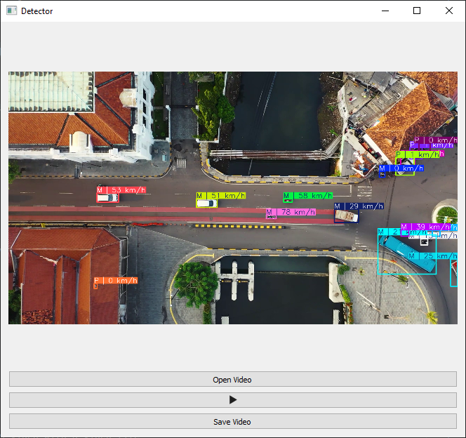

# Vehicle Tracking and Analysis

This repository contains code for vehicle tracking, speed estimation, and trend analysis from video streams. It uses YOLOv8 for object detection and tracking, and provides functionalities for real-time visualization, CLI processing, and a GUI application.

## Directory Structure

```
└── ./
├── analysis
│   ├── __init__.py
│   └── trend_analyzer.py
├── config
│   ├── __init__.py
│   └── config_handler.py
├── core
│   ├── __init__.py
│   ├── detector.py
│   └── video_processor.py
├── gui
│   ├── __init__.py
│   ├── app.py
│   ├── main.py
│   ├── managers.py
│   └── threads.py
├── models
│   ├── __init__.py
│   └── enums.py
├── utils
│   ├── __init__.py
│   ├── calculations.py
│   └── visualisations.py
├── api.py
├── cli.py
└── example.py
```


-   `analysis`: Contains modules for analyzing vehicle movement trends.
-   `config`: Handles configuration settings for the detector.
-   `core`: Core logic for object detection, tracking, and video processing.
-   `gui`: PyQt5-based graphical user interface.
-   `models`: Data models and enumerations.
-   `utils`: Utility functions for calculations and visualizations.
-   `api.py`: FastAPI application for video processing.
-   `cli.py`: Command-line interface.
-   `example.py`: Example usage of the video processing module.

## Features

-   **Object Detection and Tracking**: Utilizes YOLOv8 for accurate vehicle detection and tracking.
-   **Speed Estimation**: Calculates vehicle speeds based on pixel displacement.
-   **Trend Analysis**: Determines vehicle states (arriving, departing, parked, moving) using linear regression or simple difference methods.
-   **Real-time Visualization**: Displays tracking, speed, and direction information on video frames.
-   **GUI Application**: Provides a user-friendly interface for video processing.
-   **CLI Support**: Enables batch processing and configuration via command-line arguments.
-   **API Endpoint**: Allows video processing via a REST API.

## Installation

1.  Clone the repository:

    ```bash
    git clone [https://github.com/yourusername/vehicle-tracking-analysis.git](https://www.google.com/search?q=https://github.com/yourusername/vehicle-tracking-analysis.git)
    cd vehicle-tracking-analysis
    ```

2.  Install the required dependencies:

    ```bash
    pip install -r requirements.txt
    ```

## Usage

### CLI

To process a video using the command-line interface:

```bash
python cli.py -i path/to/input_video.mp4 -o path/to/output_video.mp4 --draw-tracks --draw-direction --show
```
You can also use a configuration file:
```bash
python cli.py -c config.yaml -i path/to/input_video.mp4 -o path/to/output_video.mp4
```
### GUI

To run the GUI application:
```bash
python gui/main.py
```

The GUI allows you to open a video file, play/pause processing, and save the processed video.

Example of GUI:


### API

To start the FastAPI server:
```bash
python api.py
```

Then, you can send a POST request to /process_video with a video file:

```bash
curl -X POST -F "file=@path/to/input_video.mp4" http://localhost:8000/process_video
```
Example output of api:
```json
{"download_url": "/download/generated_uuid.mp4", "message": "Video processed successfully"}
```

Example of processed Video:


## Configuration

The config directory contains a config_handler.py module that defines the DetectorConfig class. You can load and save configurations using YAML files.

Example config.yaml:
```yaml
weights_path: "weights/yolov8s-visdrone.pt"
show: false
draw_tracks: true
draw_direction: true
analysis_method: "linreg"
```

## Modules

`analysis/trend_analyzer.py`

This module analyzes vehicle speed trends to determine the vehicle's state (arriving, departing, parked, moving).

`core/detector.py`

The `DirectionDetector` class handles object detection, tracking, speed estimation, and trend analysis.

`core/video_processor.py`

The `process_video` function processes a video file using the `DirectionDetector`.

`gui/app.py`

The `App` class defines the main GUI application.

`utils/calculations.py`

This module provides utility functions for calculating distances and directions.

`utils/visualisations.py`

This module contains functions for drawing bounding boxes, labels, tracks, and direction arrows on video frames.
